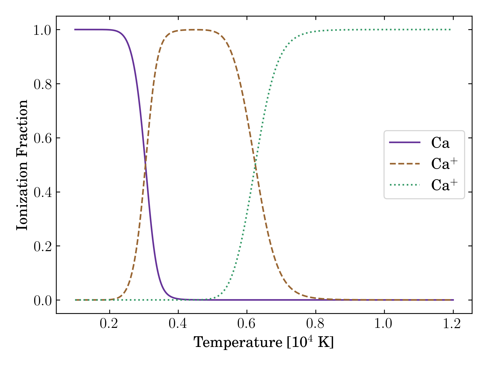

# Sitar
SIngle isoTope sAha solveR. Also a stringed instrument from the Indian subcontinent.

playing with making a Saha ionization solver

The figure below shows ionization fractions for unionized, singly, and doubly ionized Calcium.
Compare to Figure 2.6 of "Supernovae and Nucleosynthesis", David Arnett.


## Building
To build `Sitar`, simply
```sh
mkdir build && cd build
cmake ..
make -j
```
Then an executable `saha` will be created in `build/src`.

An observation: a Saha solver requires an iterative solver, such as Newton-Raphson.
Implementing Anderson accelerated Newton-Raphson provides a roughly 4x speedup for the calculations above.

## Clang-format

We use clang format for code cleanliness. 
The current version of `clang-format` used is `clang-format-13`.
